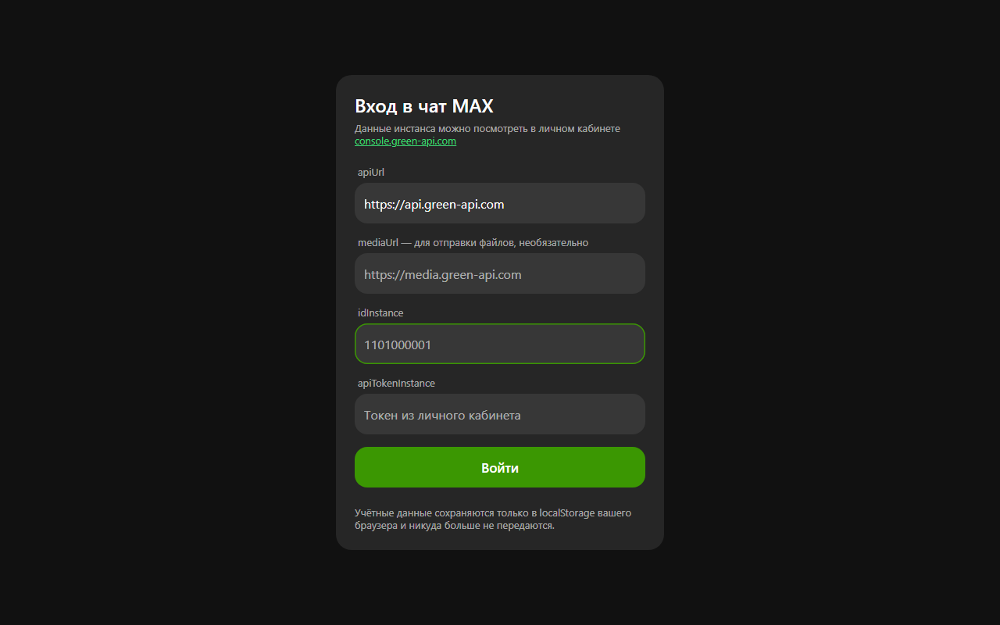
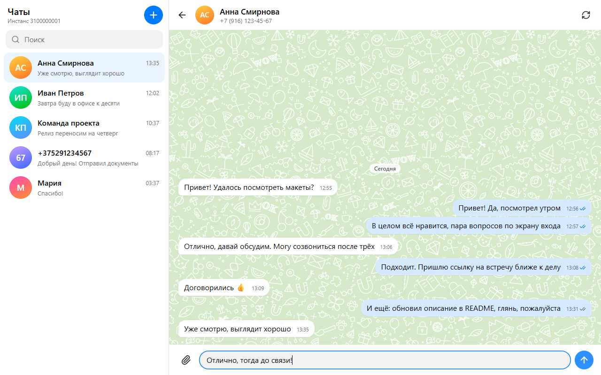

# Веб-чат MAX на GREEN-API

Одностраничное веб-приложение для переписки в мессенджере MAX через [GREEN-API](https://green-api.com):
вход по учётным данным инстанса, создание чата по номеру телефона, отправка текстовых сообщений и
приём входящих **строго по HTTP API** (`receiveNotification` + `deleteNotification`, без вебхуков).

Бэкенда нет — всё работает в браузере, учётные данные хранятся только в `localStorage`.

**Демо:** _(ссылка на деплой — добавить после первого деплоя, например `https://green-api-max-chat.vercel.app`)_

## Скриншоты

_Положите файлы в `docs/` и раскомментируйте строки ниже._

<!--  -->
<!--  -->
<!--  -->

## Возможности

- Экран входа: `apiUrl`, `idInstance`, `apiTokenInstance`; проверка через `getStateInstance`
  с понятными подсказками для состояний `notAuthorized`, `pendingPassword`, `starting`, `blocked`,
  `suspended`, `sleepMode`, `yellowCard`.
- Сохранение учётных данных в `localStorage` (в `try/catch`) и кнопка «Выйти».
- Новый чат по номеру телефона: нормализация (`+7 (999) 123-45-67` → `79991234567`) и проверка номера
  методом `CheckAccount`, который возвращает числовой `chatId` MAX. Соответствие «номер → chatId» сохраняется.
- Отправка текста методом `SendMessage` с оптимистичным отображением и статусами
  «отправляется / отправлено / ошибка». `Enter` — отправить, `Shift+Enter` — перенос строки, лимит 4000 символов.
- Список чатов загружается с сервера методом `GetChats` (как в консоли GREEN-API), превью последнего сообщения
  подгружается по очереди через `GetChatHistory`; чаты отсортированы по свежести.
- История переписки при каждом открытии чата загружается с сервера методом `GetChatHistory`, поэтому она
  появляется и на другом компьютере. localStorage — только кэш. MAX отдаёт не больше 5000 сообщений
  и не глубже 3 месяцев: более старые сообщения недоступны.
- Приём входящих последовательным HTTP-опросом очереди: каждое уведомление обязательно удаляется,
  даже нерелевантное (статусы, исходящие, медиа), иначе очередь встанет.
- Входящие слева, исходящие справа, время сообщения, автоскролл вниз, счётчик непрочитанных в списке чатов.
- Аватары собеседников методом `GetAvatar` — по одному запросу на чат, с кружком инициалов как запасным
  вариантом, если аватара нет, он скрыт настройками приватности или ссылка перестала открываться.
- Адаптивность: на ширине ≤ 760 px видно либо список чатов, либо переписку.

Намеренно не реализовано (вне рамок задания): файлы, эмодзи-пикер, группы, поиск, редактирование и удаление сообщений.

## Стек

| Область   | Решение                                   |
| --------- | ----------------------------------------- |
| Сборка    | Vite 5                                    |
| UI        | React 18 + TypeScript (strict, без `any`) |
| Стили     | CSS Modules                               |
| Состояние | React Context + `useReducer`              |
| HTTP      | нативный `fetch`                          |
| Тесты     | Vitest                                    |
| Качество  | ESLint (type-checked) + Prettier          |

## Структура проекта

```
src/
  api/
    greenApi.ts        getStateInstance, getSettings, getChats, checkAccount, getAvatar, getChatHistory, sendMessage,
                       receiveNotification, deleteNotification
    errors.ts          GreenApiError и понятные сообщения для 400/401/403/429/466/5xx и сетевых сбоев
  types/
    green.ts           типы запросов, ответов и уведомлений GREEN-API
    chat.ts            доменные типы чата и сообщения
  hooks/
    useNotificationsPolling.ts   последовательный цикл receive → обработка → delete
  store/
    chatReducer.ts     чистый редьюсер: чаты, сообщения, непрочитанные, сопоставление chatId
    ChatProvider.tsx   связь редьюсера с API и localStorage
    AuthProvider.tsx   учётные данные и вход/выход
  components/          LoginForm, ChatList, NewChatForm, ChatWindow, MessageList, MessageInput, ChatAvatar
  utils/
    phone.ts           нормализация и форматирование номера
    notification.ts    parseIncomingNotification — разбор тела уведомления
    history.ts         normalizeHistory (ответ GetChatHistory) и mergeMessages (дедупликация по idMessage)
    chatId.ts          normalizeChatId — единый формат chatId для сравнения
    devLog.ts          диагностические логи только в режиме разработки
    guards.ts          проверки данных из сети без `any`
    storage.ts         безопасные обёртки над localStorage
```

## Локальный запуск

Нужен Node.js 20+.

```bash
npm install
npm run dev     # http://localhost:5173
```

Другие команды:

```bash
npm test           # юнит-тесты (Vitest)
npm run lint       # ESLint
npm run format     # Prettier
npm run build      # сборка в dist/
npm run preview    # просмотр собранной версии
```

## Где взять apiUrl, idInstance и apiTokenInstance

1. Зарегистрируйтесь в [console.green-api.com](https://console.green-api.com).
2. Создайте инстанс для мессенджера **MAX** (подойдёт тариф «Developer»).
3. На странице инстанса скопируйте:
   - **idInstance** — например `1101000001`;
   - **apiTokenInstance** — длинная строка-токен;
   - **apiUrl** — по умолчанию `https://api.green-api.com` (в консоли может быть указан другой адрес — используйте его).
4. Авторизуйте инстанс:
   - в MAX **отключите пароль на вход** (Профиль → Настройки) — с включённым паролем QR-код не сработает;
   - в консоли нажмите «Получить QR-код для авторизации»;
   - в приложении MAX откройте Профиль → Устройства → «Войти по QR-коду» и отсканируйте код.

   Состояние должно стать `authorized` — именно это проверяет форма входа. Если вместо этого
   пришло `pendingPassword`, авторизацию нужно завершить методом `SendAuthorizationPassword`.

   Проверить состояние можно и без приложения:

   ```bash
   curl "https://3100.api.green-api.com/waInstance{{idInstance}}/getStateInstance/{{apiTokenInstance}}"
   ```

## Настройка инстанса для приёма сообщений по HTTP API

Чтобы уведомления попадали в очередь, а не уходили на вебхук:

- **webhookUrl** — пустая строка;
- **incomingWebhook** — `yes`.

Это делается в настройках инстанса в консоли или методом `SetSettings`:

```bash
curl -X POST "https://api.green-api.com/waInstance{{idInstance}}/setSettings/{{apiTokenInstance}}" \
  -H "Content-Type: application/json" \
  -d '{
        "webhookUrl": "",
        "incomingWebhook": "yes",
        "outgoingWebhook": "no",
        "outgoingMessageWebhook": "no",
        "outgoingAPIMessageWebhook": "no",
        "stateWebhook": "no"
      }'
```

Настройки применяются в течение ~5 минут, инстанс при этом перезапускается.

После входа приложение само проверяет эти настройки методом `GetSettings` и показывает баннер, если
`webhookUrl` не пустой или `incomingWebhook` выключен: в этом случае проблема в настройках инстанса, а не в коде.

## Сценарий проверки

1. `npm run dev`, открыть http://localhost:5173.
2. Ввести `apiUrl`, `idInstance`, `apiTokenInstance` → «Войти». При неверных данных появится сообщение об ошибке 401,
   при неавторизованном инстансе — подсказка про QR-код.
3. «+ Новый чат» → ввести номер получателя (например `+7 999 123-45-67`) → «Создать чат».
   Номер проверяется через `CheckAccount`; если его нет в MAX, чат не создастся и появится объяснение.
4. Написать сообщение, нажать `Enter`. Сообщение сразу появляется справа со статусом «отправляется»,
   после ответа API — «отправлено».
5. Ответить с телефона получателя в MAX. Ответ появится слева в течение ~5 секунд **без перезагрузки страницы**;
   если открыт другой чат, у нужного чата вырастет счётчик непрочитанных.
6. «Выйти» — учётные данные удаляются из `localStorage`, опрос очереди останавливается.

## Как устроен приём сообщений

```
while (не размонтировано) {
  GET  /waInstance{id}/receiveNotification/{token}?receiveTimeout=5
  если null → следующая итерация
  иначе → разобрать body → DELETE /waInstance{id}/deleteNotification/{token}/{receiptId}
}
```

Детали реализации ([src/hooks/useNotificationsPolling.ts](src/hooks/useNotificationsPolling.ts)):

- цикл строго последовательный — следующий запрос уходит только после обработки предыдущего;
- `AbortController` останавливает цикл при выходе и размонтировании компонента;
- при сетевых ошибках — экспоненциальная пауза от 1 с до 30 с, в интерфейсе показывается баннер;
- `deleteNotification` вызывается в блоке `finally`, поэтому очередь не встаёт, даже если обработчик упал;
- обрабатывается только `typeWebhook === "incomingMessageReceived"`, текст берётся из
  `messageData.textMessageData.textMessage` (`typeMessage: "textMessage"`) или
  `messageData.extendedTextMessageData.text` (`extendedTextMessage` — текст со ссылкой, `quotedMessage` — ответ
  с цитатой), остальное игнорируется;
- чат определяется по `senderData.chatId`: сначала по точному совпадению, затем по номеру
  (`senderData.senderPhoneNumber` или `номер@c.us`) — это нужно, потому что в MAX `chatId` числовой,
  а запасной формат `79991234567@c.us` используется, когда `CheckAccount` недоступен;
- если чата нет — он создаётся автоматически;
- повторно доставленные уведомления и сообщения, пришедшие и из истории, и из очереди, отсеиваются по `idMessage`
  (`mergeMessages`);
- в режиме разработки (`npm run dev`) в консоль пишутся логи `[History]`, `[Polling]`, `[Parser]`,
  `[DeleteNotification]`, `[Settings]` — без URL запросов и токена.

## CORS

**Проверено: запросы к GREEN-API работают из браузера напрямую, прокси не нужен.** Сервис отдаёт

```
Access-Control-Allow-Origin: *
Access-Control-Allow-Methods: GET, POST, OPTIONS, DELETE, HEAD
Access-Control-Allow-Headers: ..., Content-Type, ...
```

то есть проходят и preflight-запросы для `POST` с `Content-Type: application/json`, и `DELETE` для `deleteNotification`.

На случай, если запросы блокирует корпоративная сеть или расширение браузера, в
[vite.config.ts](vite.config.ts) есть готовый dev-прокси:

```bash
VITE_USE_PROXY=1 npm run dev
# и в форме входа указать apiUrl = /green-api
```

**Продакшен, если прокси всё же понадобится.** Прямые запросы означают, что токен есть на клиенте, поэтому
серверный прокси полезен и как способ спрятать токен:

- **Vercel** — добавить в `vercel.json` правило `rewrites` с `"source": "/green-api/:path*"` и
  `"destination": "https://api.green-api.com/:path*"`, либо написать serverless-функцию в `api/`,
  которая подставляет `idInstance`/`apiTokenInstance` из переменных окружения.
- **Cloudflare Workers / Nginx** — тот же приём: проксировать `/green-api/*` на `https://api.green-api.com/*`.
- **GitHub Pages** — статический хостинг без серверной части, прокси невозможен; там работает только
  прямое обращение к API (что, как показано выше, поддерживается).

## Обработка ошибок

| Ситуация  | Что видит пользователь                                                                                |
| --------- | ----------------------------------------------------------------------------------------------------- |
| 400       | «Некорректный запрос (400). Проверьте номер телефона и текст сообщения.»                              |
| 401       | «Неверные учётные данные (401). Проверьте idInstance и apiTokenInstance.»                             |
| 403       | «Доступ запрещён (403). Метод недоступен на вашем тарифе или аккаунт заблокирован.»                   |
| 429       | «Слишком много запросов (429). Подождите несколько секунд и повторите.»                               |
| 466       | «Превышена квота запросов (466). Проверьте лимиты тарифа в консоли GREEN-API.»                        |
| 5xx       | «Сервис GREEN-API временно недоступен. Повторите попытку позже.»                                      |
| Сеть/CORS | «Не удалось связаться с GREEN-API. Проверьте интернет, адрес apiUrl и блокировку запросов браузером.» |

Ошибка отправки не теряет сообщение: оно остаётся в чате со статусом «ошибка», текст ошибки — в подсказке.

## Безопасность

- `apiTokenInstance` не логируется: в консоль не попадают ни URL запросов, ни тела ответов;
  сообщения об ошибках формируются по HTTP-статусу.
- Токен хранится только в `localStorage` браузера и уходит исключительно в запросы к указанному `apiUrl`.
- Поле токена на экране входа — `type="password"` с отключённым автозаполнением.

## Тесты

```bash
npm test
```

Покрыто самое хрупкое — разбор данных из сети и нормализация ввода:

- [src/utils/phone.test.ts](src/utils/phone.test.ts) — форматы `+7…`, `8…`, 10 цифр, `375…`, отбраковка мусора;
- [src/utils/notification.test.ts](src/utils/notification.test.ts) — `textMessage`, `extendedTextMessage`,
  игнорирование статусов и медиа, устойчивость к некорректному телу уведомления;
- [src/store/chatReducer.test.ts](src/store/chatReducer.test.ts) — сопоставление входящего сообщения с чатом,
  счётчик непрочитанных, дедупликация, смена статуса отправленного сообщения.

## Деплой

### Vercel (рекомендуется)

В репозитории есть [vercel.json](vercel.json). Достаточно импортировать репозиторий в Vercel:
команда сборки `npm run build`, каталог `dist`.

```bash
npm i -g vercel
vercel        # предпросмотр
vercel --prod # продакшен
```

### GitHub Pages

Workflow [.github/workflows/deploy.yml](.github/workflows/deploy.yml) прогоняет линт, форматирование, тесты
и сборку, после чего публикует `dist` на Pages. В настройках репозитория включите
**Settings → Pages → Source: GitHub Actions**. Базовый путь подставляется автоматически через `VITE_BASE`;
локально то же самое делается так:

```bash
VITE_BASE=/green-api-max-chat/ npm run build
```
